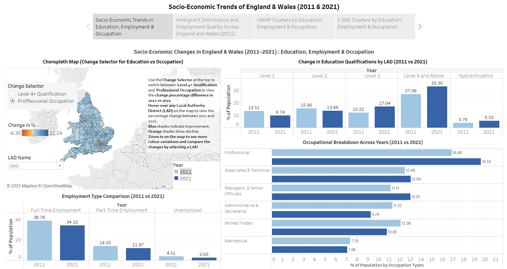
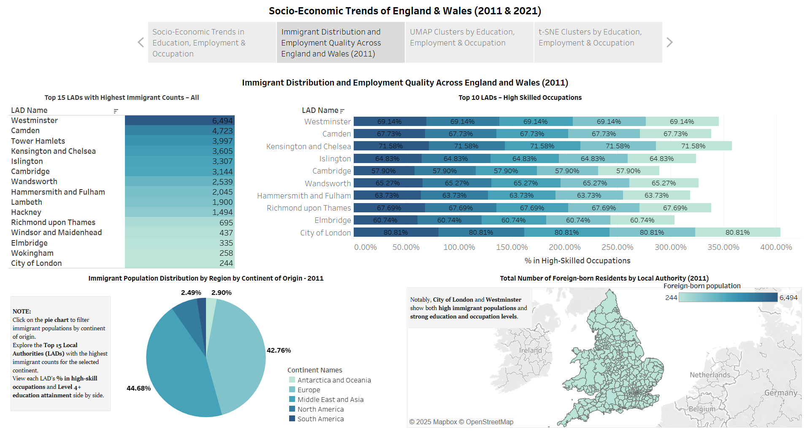
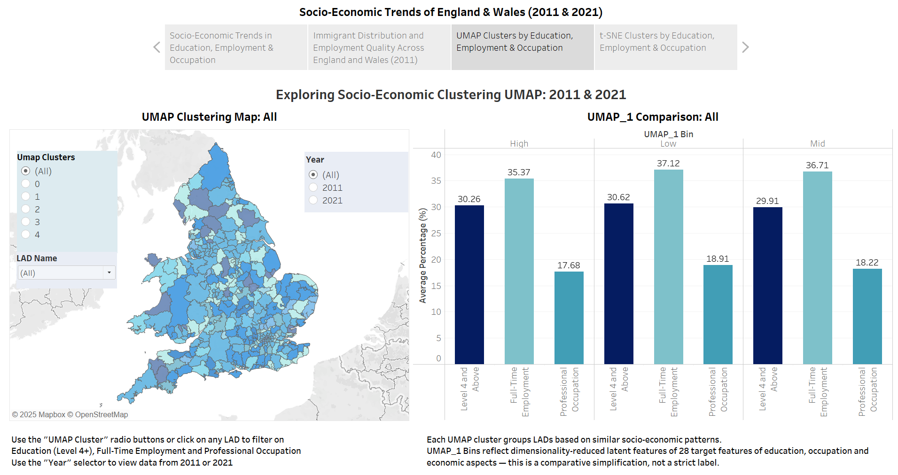
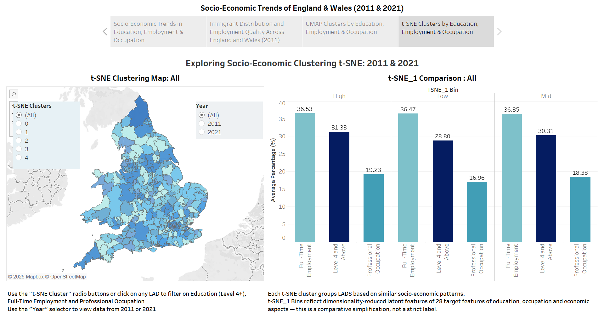

# MSc Socio-Economic Analytics: UK Census 2011–2021 with Bayesian Modelling & Tableau Dashboards

This repository contains my MSc Data Science project **"Exploring Socio-Economic Analytics using Bayesian Modelling and Interactive Tableau Dashboards"**, conducted at the **University of Bristol (Mar–May 2025)**.  
The project investigates **education, employment, occupation, and immigration trends** across **348 Local Authority Districts (LADs)** in England and Wales, comparing the **2011 and 2021 UK Census**.

## 📊 Project Overview
- **Objective:** To analyze decade-long socio-economic changes and provide **interactive dashboards** for policy analysts, international students, and education planners.  
- **Data Sources:**  
  - 2011 & 2021 UK Census (Nomis, ONS)  
  - LAD geocoding & mappings from ONS Geography Codes  

- **Key Methods:**
  - **Bayesian Ridge Regression**: Imputation of missing 2021 LAD values (31 districts)  
  - **Dimensionality Reduction**: UMAP & t-SNE for 2D socio-economic clustering  
  - **KMeans Clustering**: Grouping LADs (k=5) to reveal regional shifts  
  - **Interactive Dashboards (Tableau)**: Education, Employment, Immigration, Cluster Transitions  

---

## ⚙️ Methodology
1. **Data Integration:**  
   - Standardised LAD codes across 2011 & 2021  
   - Harmonised 10 socio-economic datasets (education, employment, occupation, migration)  

2. **Imputation (Bayesian Ridge Regression):**  
   - Predicted missing LAD values using 2011 trends  
   - Quantified coefficient uncertainty with credible intervals  
   - Aligned imputed values to population totals  

3. **Clustering & Dimensionality Reduction:**  
   - UMAP & t-SNE projections of 28 features  
   - KMeans clustering (k=5) to identify regional shifts  

4. **Visual Analytics (Tableau):**  
   - Choropleth maps  
   - Interactive filters (Year, Cluster, LAD, Continent)  
   - Linked bar charts, highlight tables, and tooltips  

---

## 🖼️ Dashboards & Visuals
### 1. Education & Employment Change (2011 vs 2021)

### 2. Immigration & Skilled Employment

### 3. UMAP Clustering of LADs

### 4. t-SNE Clustering of LADs

---

## 🔑 Key Insights
- **Education:** Level 4+ qualifications increased nationally (27.06% → 33.30%).  
- **Occupations:** Rise in professional roles (16.88% → 19.59%), decline in trades & mechanical jobs.  
- **Employment:** Full-time employment decreased (38.76% → 34.10%), partly due to Brexit & pandemic.  
- **Immigration:** Highest foreign-born populations in Westminster, Camden, City of London; strong alignment between education and skilled employment.  
- **Clustering:** UMAP & t-SNE revealed LAD groupings with similar socio-economic profiles, highlighting regional shifts between 2011 and 2021.  

---

## 🛠️ Tools & Technologies
- **Python:** Pandas, Scikit-learn, UMAP, t-SNE, KMeans, Matplotlib, Seaborn  
- **Tableau:** Interactive dashboards, choropleth maps, highlight tables  
- **Data Sources:**  
  - [Nomis Census Data](https://www.nomisweb.co.uk/)  
  - [ONS Statistics](https://www.ons.gov.uk/)  
  - [ONS Geography Codes](https://geoportal.statistics.gov.uk/)  

---

## 📚 References
1. Munzner, T. (2014). *Visualization Analysis and Design*. CRC Press.  
2. Ware, C. (2020). *Information Visualization: Perception for Design (4th ed.)*. Morgan Kaufmann.  
3. Tufte, E. R. (2001). *The Visual Display of Quantitative Information (2nd ed.)*. Graphics Press.  
4. Fry, B. (2007). *Visualizing Data*. O’Reilly Media.  
5. Géron, A. (2019). *Hands-On Machine Learning with Scikit-Learn, Keras, and TensorFlow (2nd ed.)*. O’Reilly Media.  
6. Raschka, S., & Mirjalili, V. (2019). *Python Machine Learning (3rd ed.)*. Packt.  
7. Hastie, T., Tibshirani, R., & Friedman, J. (2009). *The Elements of Statistical Learning*. Springer.  
8. Murphy, K. P. (2012). *Machine Learning: A Probabilistic Perspective*. MIT Press.  
9. Bishop, C. M. (2006). *Pattern Recognition and Machine Learning*. Springer.  
10. McInnes, L., Healy, J., & Melville, J. (2018). *UMAP: Uniform Manifold Approximation and Projection for Dimension Reduction*. arXiv:1802.03426.  
11. van der Maaten, L., & Hinton, G. (2008). *Visualizing Data using t-SNE*. JMLR, 9(Nov), 2579–2605.  
12. Tipping, M. E. (2001). *Sparse Bayesian Learning and the Relevance Vector Machine*. JMLR, 1(Jun), 211–244.  
13. Nomis Census Data (2011 & 2021). https://www.nomisweb.co.uk/  
14. Office for National Statistics (ONS). https://www.ons.gov.uk/  
15. ONS Geography Codes & Lookups. https://geoportal.statistics.gov.uk/  
16. Tableau Desktop (2025). https://www.tableau.com/  

---

## 👩‍🎓 Author
**Thrisha Rajkumar**  
MSc Data Science – University of Bristol  
🔗 [LinkedIn](https://www.linkedin.com/in/thrisha-rajkumar/)  

---
